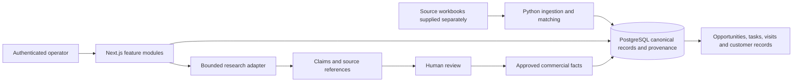

# Karrot Revenue OS: portfolio source edition

An independent account-management and evidence-review application built by Santiago Gonzalez Alvarez. It connects a provider and facility directory to research, reviewed claims, opportunities, tasks, visits, and customer lifecycle records.

This public edition contains application source, database migrations, ingestion algorithms, and tests. It has a fresh history and no connection to the original deployment. It includes no government workbooks, company reference documents, customer exports, or production credentials. It is not an official Karrot Care product and does not imply endorsement or permission to contact organisations on its behalf.

## Why this system exists

Revenue teams often mix authoritative source data, human decisions, and generated research in the same account record. This project keeps those forms of evidence separate so an operator can see what is known, what was inferred, and what still requires review.

## Architecture



The implementation uses Next.js, React, TypeScript, Supabase Authentication and PostgreSQL, Row Level Security, Zod, and a Python ingestion package. Routes compose feature modules; each feature owns its server commands and user interface. Database migrations own durable constraints and permissions.

## Engineering decisions worth inspecting

- **Three information layers:** canonical source records, human-operated commercial state, and reviewable intelligence have separate ownership.
- **Provenance:** import runs, source checksums, original rows, matching decisions, and review state are explicit database concepts.
- **Conservative matching:** ambiguous facility matches enter a review queue rather than being silently accepted.
- **Human review:** generated claims do not become commercial facts until approved or corrected.
- **Durable research:** successfully started provider requests have persisted run state, with polling and reconciliation paths.
- **Sample boundaries:** fictional accounts are explicitly marked and excluded from authoritative market coverage and automated research.
- **Access control:** server commands check the operator and database policies constrain reads and writes. This is a single-workspace application, not a claim of complete multi-tenant isolation.

## Start with the code

| Path | What to evaluate |
| --- | --- |
| `src/features/accounts` | Account commands, workspace composition, contacts, opportunities and next actions |
| `src/features/intelligence` | Research state, structured claims and human review |
| `src/features/market` | Provider search and directory behavior |
| `src/features/visits` | Field visit planning |
| `src/infrastructure/supabase` | Authentication and database clients |
| `supabase/migrations` | Schema, RLS, invariants and state transitions |
| `services/ingestion` | Normalization, matching and workbook ingestion |
| `tests` | Unit and database integration checks |

## Run locally

Use Node.js 24, Python 3.12 or newer, and Docker for the optional local Supabase stack.

```bash
npm ci
cp .env.example .env.local
npm run db:start
npm run db:reset
npx supabase status
```

The reset command resets the local database for this dedicated checkout. Copy the local API URL and publishable key into `.env.local`. Create a local user in Supabase Studio, confirm its email, and promote that user's profile to `owner` through the local SQL editor if you want to exercise write paths. Public signup is disabled. Use a password you choose locally; this repository does not publish a shared account password.

```bash
npm run dev
```

Open `http://localhost:3000`. The public edition starts with an empty market. Use `supabase/portfolio-sample.sql` in the local SQL editor to add one clearly fictional sample account. Government ingestion requires separately obtained, appropriately licensed workbooks and a source manifest; the original datasets are deliberately excluded.

No API key is required for code review or the unit tests. Leave the research key empty for this local portfolio review. Live research is optional and requires separate provider configuration.

## Validation

```bash
npm test
npm run build
python -m pip install -r requirements.txt
python -m pytest tests/unit/ingestion/test_normalization.py tests/unit/ingestion/test_matching.py
```

The workbook reconciliation tests in `test_source_audit.py` require the original source publications and are retained as a record of the full-system contract. They are not part of the dataset-free public test command. Database integration tests require a running local PostgreSQL/Supabase instance. See [verification](docs/VERIFICATION.md) for the actual results and limits of this publication review.

## Scope and limitations

This source edition does not send outreach or synchronise with a live external CRM. It does not include the original deployed database, deployment runbooks, account histories, screenshots, company material, or data exports. It preserves the application code for technical evaluation, but source-data workflows cannot be demonstrated without supplying licensed inputs. The code has not been granted an open-source license.

See [publication boundaries](docs/PUBLICATION.md) for the source selection and [architecture](docs/ARCHITECTURE.md) for the trust boundaries.
